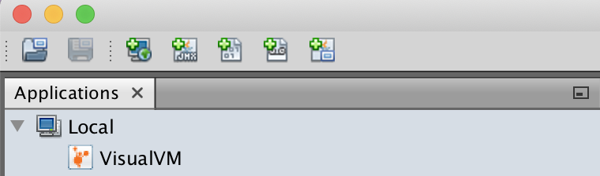
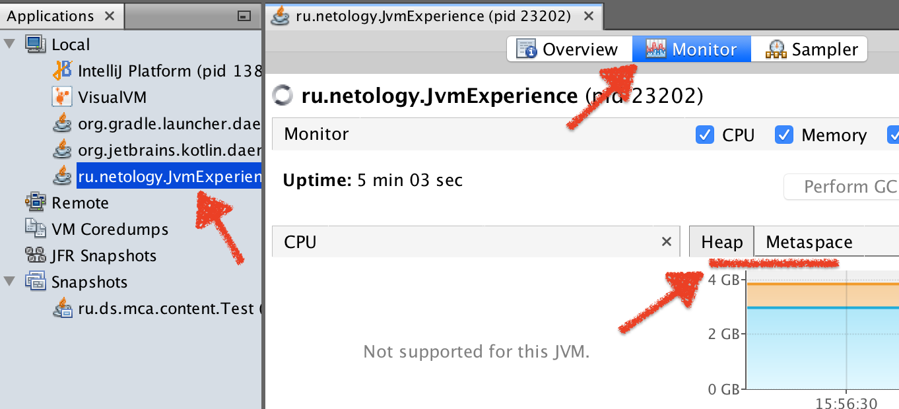

# Задача "Понимание JVM"

## Описание
Просмотрите код ниже и опишите (текстово или с картинками) каждую строку с точки зрения происходящего в JVM

Не забудьте упомянуть про:
- ClassLoader'ы,
- области памяти (стэк (и его фреймы), хип, метаспейс)
- сборщик мусора

## Код для исследования
```java

public class JvmComprehension {         // 0 - ClassLoader загружает классы в область памяти "Metaspace": 
                                            // JvmComprehension, Object, System, Integer
                                        // 0.1 - выполняется Проверка кода, Подготовка примитивов, Связывание ссылок
                                        // 0.2 - выполняется Инициализация статических полей / методов

    public static void main(String[] args) {    // 0.3 - в области памяти "Стек" выделяется фрейм для метода класса
        
        int i = 1;                      // 1 - в области памяти "Стек" выделяется память под переменную "i" 
        Object o = new Object();        // 2 - в области памяти "Стек" выделяется память под переменную "o"
                                            // в области памяти "Куча" выделяется память под объект "Object"
                                            // в области памяти "Куча" создается новый экземпляр объект "Object" 
                                            // переменная "o" связывается с новым объектом "Object" 
        Integer ii = 2;                 // 3 - в области памяти "Стек" выделяется память под переменную "ii"
                                        // в области памяти "Куча" выделяется память под объект "Integer"
                                        // в области памяти "Куча" создается новый экземпляр объект "Integer" 
                                        // переменная "ii" связывается с новым объектом "Integer" 
        printAll(o, i, ii);             // 4 - в области памяти "Стек" выделяется фрейм для метода класса
                                            // в метод класса передаются переменные:
                                            // "о", "ii" - по ссылке, "i" - по значению
        System.out.println("finished"); // 7 - аналогично шагам из этапа 6 ниже 
    }

    private static void printAll(Object o, int i, Integer ii) { // 4* - в области памяти "Стек" выделяется фрейм для метода класса
        Integer uselessVar = 700;                   // 5 - в области памяти "Стек" выделяется память под переменную "uselessVar"
                                                        // в области памяти "Куча" выделяется память под объект "Integer"
                                                        // в области памяти "Куча" создается новый экземпляр объект "Integer" 
                                                        // переменная "uselessVar" связывается с новым объектом "Integer" 
        System.out.println(o.toString() + i + ii);  // 6 - в области памяти "Стек" выделяется фрейм для метода "println" класса "System"
                                                        // в области памяти "Стек" выделяется фрейм для метода "toString" класса "o"
                                                        // в области памяти "Стек" выделяется переменная "Y" для вычисления аргумента метода "println" класса "System" 
                                                        // метод "toString" выполняется, результат складывается с переменными "i" и "ii", записывается в переменную "Y" 
                                                        // выполняется "println" класса "System" с параметром "Y"
    }
}

```

# Задача "Исследование JVM через VisualVM"

## Описание
Предлагаем вам изучить использование памяти через VisualVM при загрузке новых классов и создании новых объектов

## Инструкция
Скачайте и установите утилиту [VisualVM](https://visualvm.github.io/download.html).  
Откройте её и обратите внимание на раздел `Applications -> Local`



Запульте и запустите проект [отсюда](https://github.com/Arsennikum/jvm-visualvm-experience).  
После запуска сразу же (у вас будет на это 30 сек, см. код) щелкните дважды по появившейся запущенной нашей программе в разделе `Local` (о котором упоминалось выше)  
Перейдите на вкладку `Monitor` и можете наблюдать метрики программы в реальном времени. Присмотритесь к разделам `Heap`, `Metaspace`   


Когда программа завершится, изучите вывод консоли и код программы (в код можете не погружаться, главное - метод main). Соотнесите с графиками в разделах `Heap`, `Metaspace` и `Classes`

Числовые значения в main методе можете менять по своему усмотрению в соответсвии с вашим железом и как вы считаете, будет показательно.

Сделайте скриншоты графиков и отметьте на них с помощью простого графического редактора и текста, в какие моменты какие действия программы происходили.  
Для выполнения задания нужно отметить на таймлайне графиков каждую строку, которую вывела в консоль программа и пояснить её своими словами в тексте  
Данные скриншоты и текст отправьте в качестве домашнего задания (их также можно добавить в репозиторий. Для текста можете использовать формат Markdown)  